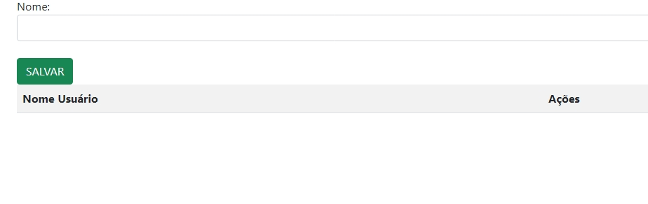

# # Projeto login-cad
 
Este projeto é uma aplicação web simples para cadastrar, listar, editar e excluir nomes de usuários. A página permite que o usuário insira um nome, que é armazenado em uma lista e exibido em uma tabela abaixo. As funções de edição e exclusão estão disponíveis diretamente na tabela.

# imagem do projeto:

# ``estrutura do projeto``

* index.html: A página principal que contém a interface de cadastro.
* controller.js: Contém as funções JavaScript responsáveis pela lógica de manipulação dos dados.
* main.css: (Opcional) Arquivo de estilos CSS para customizar a aparência da aplicação.
* Bootstrap: Biblioteca CSS externa para facilitar o uso de componentes visuais como botões e tabelas.

 

