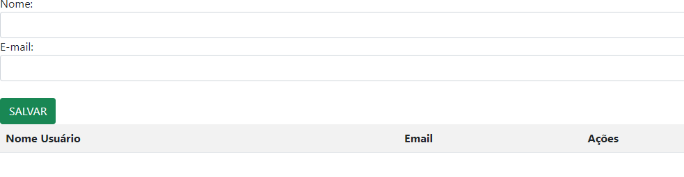

## Validação de Acesso e Gerenciamento de Lista de Usuários
 
## 📄 ``Descrição``
Este projeto feito durante as aulas de Programação Web I, é uma aplicação básica em JavaScript que gerencia um sistema de login e uma lista de usuários. Ele permite que os usuários se autentiquem e que gerenciem uma lista de nomes, com funcionalidades para adicionar, editar e excluir itens da lista.
 
## ``Funcionalidades``
 
### Autenticação de Usuário
* Função acessar(): Verifica se o email e a senha foram preenchidos antes de redirecionar o usuário para a página de cadastro.

## ``Estrutura do Projeto``
O projeto é composto por dois formulários principais:
 
1. *Formulário de Login*: Permite que o usuário insira seu email e senha para acessar o sistema. Se os dados forem válidos, o usuário é redirecionado para a página de cadastro.
   
   - *Validação*: A função acessar() verifica se o email contém os caracteres '@' e '.' e se a senha foi preenchida. Se qualquer validação falhar, uma mensagem de erro é exibida.
   
2. *Formulário de Cadastro*: Permite que o usuário insira seu nome e email para se cadastrar no sistema. Os dados são armazenados em arrays (userLista e emaillista) e exibidos em uma tabela abaixo do formulário.
 
   - *Salvamento e Validação*: A função salvarUser() verifica se os campos foram preenchidos corretamente e armazena os dados nos arrays. Se algum campo estiver vazio, uma mensagem de alerta é exibida
 
## ``Instruções de como usar``
 
### Autenticação
 
#### Para autenticar um usuário:
 
* Preencha o campo de email (loginEmail) e o campo de senha (loginSenha).
* Clique no botão de acesso.
* Se ambos os campos estiverem preenchidos, você será redirecionado para a página cadastro.html. Caso contrário, um alerta pedirá que você preencha todos os campos.
 
## ``Gerenciamento da Lista de Usuários``
 
#### Adicionar Usuário
 
* Digite um nome no campo de entrada (nomeUser).
* Clique no botão para salvar o usuário.
* O nome será adicionado à lista e exibido na tabela. O campo de entrada será limpo.
 
#### Editar Usuário
* Clique no botão "Editar" ao lado do nome que deseja editar.
* O nome será preenchido no campo de entrada (nomeUser), e o item será removido da lista.
* Modifique o nome e salve-o novamente se desejar.
 
#### Excluir Usuário
* Clique no botão "Excluir" ao lado do nome que deseja remover.
* O nome será removido da lista e da tabela HTML.

# Tecnologias Utilizadas
 
- *HTML5*: Estrutura do projeto, incluindo os formulários de login e cadastro.
- *CSS3*: Utilizado para estilizar os formulários e a tabela de visualização dos usuários cadastrados.
- *JavaScript*: Implementação da lógica de validação, cadastro, edição e exclusão de usuários.
 
# imagem do projeto:

 

